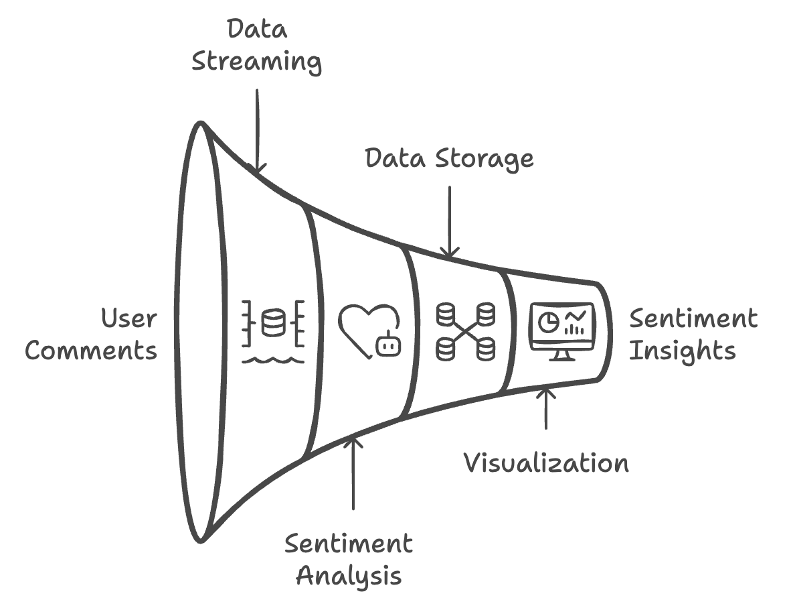
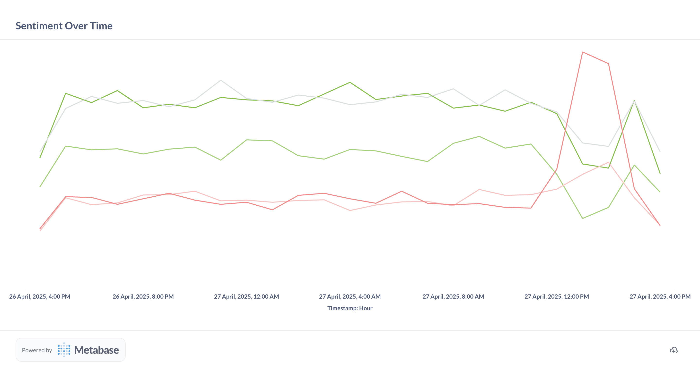
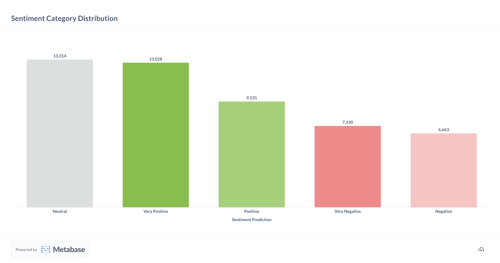
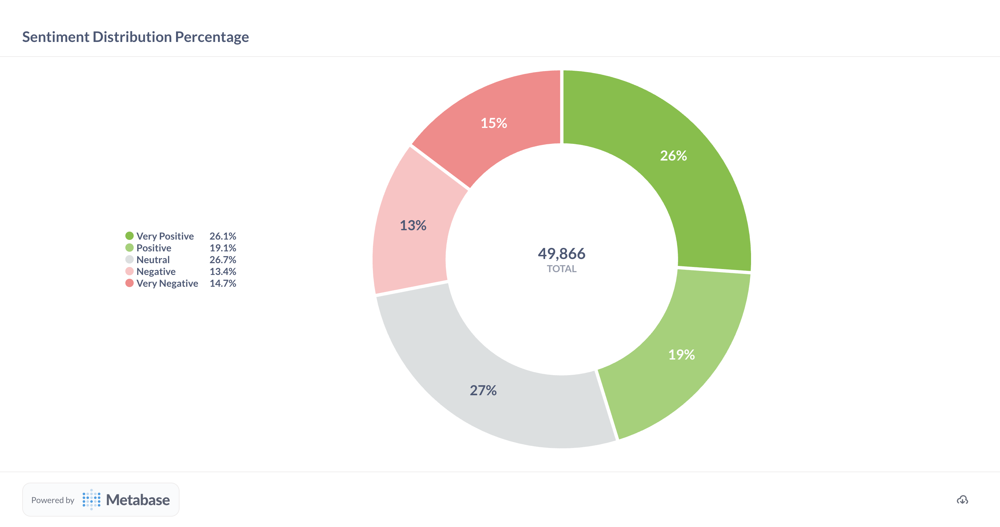

# Real-Time YouTube Sentiment Analysis Pipeline

A comprehensive big data pipeline for real-time sentiment analysis of YouTube live chat messages, combining Apache Kafka, Apache HBase, MySQL, and Metabase.

## Table of Contents

- [Project Overview](#project-overview)
- [System Architecture](#system-architecture)
- [Requirements](#requirements)
- [Getting Started](#getting-started)
- [Component Documentation](#component-documentation)
  - [Docker Environment](#docker-environment)
  - [Apache ZooKeeper](#apache-zookeeper)
  - [Apache Kafka](#apache-kafka)
  - [Apache HBase](#apache-hbase)
  - [MySQL](#mysql)
  - [Metabase](#metabase)
  - [Python Components](#python-components)
- [Project Structure](#project-structure)
- [Running the Project](#running-the-project)
- [Troubleshooting](#troubleshooting)

## Project Overview

This project implements a sophisticated big data pipeline for real-time sentiment analysis of YouTube live chat messages. It demonstrates key concepts in distributed systems, data streaming, storage, and analytics.

The system captures comments from YouTube live streams in real-time, processes each message through sentiment analysis, and makes the results available for real-time monitoring and visualization, allowing content creators and moderators to understand audience sentiment during live events.

## System Architecture

The project follows a modular microservices architecture:


*Figure 1: High-level architecture showing data flow between components in the sentiment analysis pipeline*

**Data Flow:**

1. **Producer**: Streams real-time comments from YouTube live chats using the YouTube Data API
2. **Kafka**: Streams the comments to consumers in real-time
3. **Consumer**: Processes incoming streams and coordinates with other components
4. **Sentiment Analysis**: Analyzes comment sentiment using a pre-trained transformer model
5. **Storage**:
   - Raw data stored in HBase (NoSQL)
   - Processed results stored in MySQL (SQL)
6. **Visualization**: Sentiment trends and insights displayed in Metabase dashboards

## Requirements

- Docker and Docker Compose
- Python 3.8+
- 8GB+ RAM available for Docker containers
- Mac/Linux/Windows with Docker support

## Getting Started

### 1. Clone the Repository

```bash
git clone https://github.com/alonsarias/youtube-sentiment-pipeline.git
cd youtube-sentiment-pipeline
```

### 2. Install Python Dependencies

```bash
pip install -r requirements.txt
```

### 3. Start the Docker Environment

```bash
docker-compose up -d
```

This command starts all necessary services: ZooKeeper, Kafka, HBase, MySQL, and Metabase.

### 4. Verify Services are Running

```bash
docker-compose ps
```

All services should have a "running" state.

## Component Documentation

### Docker Environment

The project uses Docker Compose to orchestrate multiple containers. The `docker-compose.yml` file defines the following services:

- **ZooKeeper**: Distributed coordination service
- **Kafka**: Message streaming platform
- **HBase**: NoSQL database for raw data
- **MySQL**: Relational database for processed data
- **Metabase**: Visualization platform

**Running Docker Commands:**

```bash
# Start all services
docker-compose up -d

# Stop all services
docker-compose down

# View logs from all services
docker-compose logs

# View logs from a specific service
docker-compose logs kafka
```

### Apache ZooKeeper

**Purpose:** Provides distributed configuration and synchronization service.

**Implementation:** Uses the official Confluent ZooKeeper image configured for Apple Silicon compatibility.

**Configuration:**
- Client Port: 2181
- Tick Time: 2000ms

**Verification:**

```bash
# Test ZooKeeper connection
echo ruok | nc localhost 2181
# Should respond with "imok"
```

### Apache Kafka

**Purpose:** Distributed event streaming platform that handles the real-time comment stream.

**Implementation:** Uses Confluent's Kafka image with multi-listener setup for both internal and external connections.

**Configuration:**
- External Port: 9092
- Topic: "comments" (configurable in .env)
- Replication Factor: 1 (development setup)

**Kafka Commands:**

```bash
# List topics
docker exec kafka kafka-topics --bootstrap-server localhost:9092 --list

# Create a topic manually (if needed)
docker exec kafka kafka-topics --bootstrap-server localhost:9092 --create --topic comments --partitions 1 --replication-factor 1

# Consume messages from the topic (for debugging)
docker exec kafka kafka-console-consumer --bootstrap-server localhost:9092 --topic comments --from-beginning
```

### Apache HBase

**Purpose:** NoSQL database for storing raw comment data.

**Implementation:** Uses HBase in standalone mode, connected to the ZooKeeper service.

**Configuration:**
- Thrift API Port: 9090 (used by Python client)
- Web UI: http://localhost:16010
- Uses external volume for data persistence

**HBase Tables:**
- `comments`: Stores raw comment data
  - Column Family: `data`
  - Columns: `user_id`, `comment`, `sentiment`

**HBase Commands:**

```bash
# Access HBase shell
docker exec -it hbase hbase shell

# List tables
list

# Scan comments table (view data)
scan 'comments', {LIMIT => 10}
```

### MySQL

**Purpose:** Relational database for storing processed sentiment results.

**Implementation:** Uses MySQL 8.0 with native authentication for easier client connectivity.

**Configuration:**
- Port: 3306
- Default Database: sentiment_analysis
- Default User: user/password (configurable)
- Uses external volume for data persistence

**Schema:**
- `sentiment_results` table: Stores sentiment analysis results
  - `row_key`: Unique identifier (primary key)
  - `user_id`: User identifier
  - `comment_text`: Original comment text
  - `timestamp`: Comment timestamp
  - `sentiment`: Sentiment classification
  - `sentiment_score`: Optional confidence score

**MySQL Commands:**

```bash
# Connect to MySQL
docker exec -it mysql mysql -u user -ppassword sentiment_analysis

# View sentiment results
SELECT * FROM sentiment_results LIMIT 10;

# Get sentiment distribution
SELECT sentiment, COUNT(*) FROM sentiment_results GROUP BY sentiment;
```

### Metabase

**Purpose:** Data visualization and dashboarding platform.

**Implementation:** Uses the official Metabase image, connected to MySQL.

**Configuration:**
- Web UI: http://localhost:3000
- Default login: email@domain.com / metabase

**Setup Instructions:**

1. Access Metabase at http://localhost:3000
2. Complete the initial setup
3. Add MySQL as a data source:
   - Host: mysql
   - Port: 3306
   - Database: sentiment_analysis
   - Username: user
   - Password: password
4. Create dashboards to visualize sentiment trends

### Python Components

#### 1. Producer (`producer.py`)

**Purpose:** Streams YouTube live chat messages to Kafka for real-time sentiment analysis.

**Implementation:** Connects to the YouTube Data API to retrieve live chat messages from ongoing streams and sends them to Kafka for processing.

**Configuration:**
- Requires a YouTube API key in `.env` file
- Configurable poll interval (default: 5 seconds)
- Rate limiting and error handling for the YouTube API

**YouTube API Configuration:**
To use the Producer with YouTube live chats, you need to:
1. Obtain a YouTube Data API v3 key from the [Google Cloud Console](https://console.cloud.google.com)
2. Add the key to your `.env` file as `YOUTUBE_API_KEY=your_key_here`
3. Configure poll intervals with `YOUTUBE_POLL_INTERVAL` (seconds, default: 5)
4. Set maximum results per request with `YOUTUBE_MAX_RESULTS` (default: 200)

**Running the Producer:**

```bash
# Specify a YouTube video ID as command line argument
python src/producer.py <youtube_video_id>
```

**Key Features:**
- Real-time processing of live chat messages
- Intelligent handling of YouTube API quota limitations
- Automatic retry mechanisms for resilient operation

#### 2. Consumer (`consumer.py`)

**Purpose:** Processes comment streams, coordinates sentiment analysis, and stores results.

**Implementation:** Consumes messages from Kafka, orchestrates sentiment analysis, and manages data storage in both HBase and MySQL.

**Running the Consumer:**

```bash
python src/consumer.py
```

#### 3. Sentiment Analyzer (`sentiment_analyzer.py`)

**Purpose:** Performs sentiment analysis on comment text.

**Implementation:** Uses a pre-trained transformer model from Hugging Face to classify sentiment.

**Model Details:**
- Default model: [tabularisai/multilingual-sentiment-analysis](https://huggingface.co/tabularisai/multilingual-sentiment-analysis)
- Classification: 5 categories (Very Negative to Very Positive)

#### 4. Configuration (`config.py`)

**Purpose:** Centralizes configuration for all components.

**Implementation:** Uses environment variables with sensible defaults.

**Environment Variables:**
- Kafka: `KAFKA_BOOTSTRAP_SERVERS`, `KAFKA_TOPIC`, etc.
- HBase: `HBASE_HOST`, `HBASE_PORT`, etc.
- MySQL: `MYSQL_HOST`, `MYSQL_DATABASE`, etc.
- Sentiment: `SENTIMENT_MODEL_NAME`, etc.

## Project Structure

```
youtube-sentiment-pipeline/
├── docker-compose.yml        # Docker services configuration
├── requirements.txt          # Python dependencies
├── .env                      # Environment variables configuration
├── README.md                 # Project documentation
├── LICENSE                   # MIT License file
└── src/
│   ├── config.py             # Centralized configuration
│   ├── consumer.py           # Kafka consumer and orchestration
│   ├── hbase_utils.py        # HBase database utilities
│   ├── mysql_client.py       # MySQL database utilities
│   ├── producer.py           # Streams YouTube live chat messages to Kafka using the YouTube Data API
│   ├── sentiment_analyzer.py # ML-based sentiment analysis
│   └── sentiment_processor.py # Sentiment processing orchestration
├── images/                   # Visualization and diagram assets
│   ├── system_architecture.png        # System architecture diagram
│   ├── bar_chart_visualization.png    # Bar chart of sentiment distribution
│   ├── pie_chart_visualization.png    # Pie chart of sentiment percentages
│   └── time_series_visualization.png  # Time series of sentiment trends
```

### Directory Structure Explanation

- **Root Directory**: Contains project-level configuration files and documentation
  - `docker-compose.yml`: Defines and configures all Docker services needed for the project
  - `requirements.txt`: Lists Python dependencies needed for the application components
  - `.env`: Environment variables configuration file for all services and components
  - `README.md`: Project documentation with setup instructions and component explanations
  - `LICENSE`: MIT License file

- **src/**: Contains all application source code, organized by component function
  - **Data Pipeline**:
    - `producer.py`: Streams YouTube live chat messages to Kafka using the YouTube Data API
    - `consumer.py`: Consumes comment data from Kafka and coordinates processing

  - **Data Processing**:
    - `sentiment_analyzer.py`: Implements ML model-based sentiment analysis logic
    - `sentiment_processor.py`: Orchestrates the sentiment analysis and storage workflow

  - **Data Storage**:
    - `hbase_utils.py`: Provides functions to interact with HBase for raw comment storage
    - `mysql_client.py`: Provides functions to interact with MySQL for sentiment result storage

  - **Configuration**:
    - `config.py`: Centralizes configuration for all components via environment variables

- **images/**: Contains visualization assets and diagrams
  - `system_architecture.png`: High-level system architecture diagram
  - `time_series_visualization.png`: Example of time series sentiment analysis chart
  - `bar_chart_visualization.png`: Example of sentiment distribution bar chart
  - `pie_chart_visualization.png`: Example of sentiment distribution pie chart

The project follows a modular architecture with clear separation of concerns between data ingestion, processing, and storage components. This structure makes it easy to understand the data flow and modify individual components as needed.

## Running the Project

### Step 1: Start the Infrastructure

```bash
# Start all services
docker-compose up -d

# Wait for services to initialize (approximately 1-2 minutes)
```

### Step 2: Run the Consumer

```bash
# In one terminal
python src/consumer.py
```

### Step 3: Run the Producer

```bash
# In another terminal
python src/producer.py <youtube_video_id>
```

### Step 4: Monitor and Visualize

1. Access HBase Web UI: http://localhost:16010
2. Access Metabase: http://localhost:3000
3. Create dashboards to monitor sentiment trends

#### Visualization Examples

Here are step-by-step examples to create useful visualizations for monitoring sentiment analysis:

##### Example 1: Time Series Line Chart - Sentiment Over Time

This visualization shows how sentiment trends change over time.


*Figure 2: Time series showing sentiment trends over time. Peaks in positive sentiment correlate with product launches and promotional events.*

1. In Metabase, click on "New" > "Question"
2. In the top navigation, select your database (e.g., "Sentiment Analysis Big Data Simulation")
3. Click on "Comments" table
4. Click on the "Summarize" button
5. For "Pick a function or metric", select "Count of rows"
6. For "Pick a column to group by", select "timestamp"
7. You can refine the time grouping by clicking on "by month" and changing to hour, day, or week
8. Click "+ Add another grouping"
9. Select "sentiment_prediction" to break down data by sentiment categories
10. Click "Visualize" button at the bottom
11. Click "Line" in the visualization selector
12. Use the "Settings" panel to customize colors and display options
13. Click "Save" and add it to your dashboard

##### Example 2: Bar Chart - Sentiment Category Distribution

This visualization shows the count of comments in each sentiment category.


*Figure 3: Bar chart showing the distribution of sentiment categories. This sample shows a healthy distribution across the five sentiment levels from Very Negative to Very Positive.*

1. In Metabase, click on "New" > "Question"
2. In the top navigation, select your database (e.g., "Sentiment Analysis Big Data Simulation")
3. Click on "Comments" table
4. Click on the "Summarize" button
5. For "Pick a function or metric", select "Count of rows"
6. For "Pick a column to group by", select "sentiment_prediction"
7. Click "Visualize" button at the bottom
8. Click "Bar" in the visualization selector
9. Use the "Settings" panel to customize colors, axis labels, and display options
10. Click "Save" and add it to your dashboard

##### Example 3: Pie Chart - Sentiment Distribution Percentage

This visualization shows the proportion of each sentiment category as a percentage.


*Figure 4: Pie chart showing the percentage distribution of the five sentiment categories (Very Negative, Negative, Neutral, Positive, Very Positive), providing a quick overview of overall customer sentiment.*

1. In Metabase, click on "New" > "Question"
2. In the top navigation, select your database (e.g., "Sentiment Analysis Big Data Simulation")
3. Click on "Comments" table
4. Click on the "Summarize" button
5. For "Pick a function or metric", select "Count of rows"
6. For "Pick a column to group by", select "sentiment_prediction"
7. Click "Visualize" button at the bottom
8. Click "Pie" in the visualization selector
9. In the "Settings" panel, enable "Show percentage" option
10. Optionally, customize colors and legend position
11. Click "Save" and add it to your dashboard

### Step 5: Shutdown

```bash
# Stop the Python processes with Ctrl+C
# Stop the Docker containers
docker-compose down
```

## Troubleshooting

### Kafka Connection Issues

If the producer or consumer can't connect to Kafka:

```bash
# Check if Kafka is running
docker-compose ps kafka

# Check Kafka logs
docker-compose logs kafka

# Ensure the topic exists
docker exec kafka kafka-topics --bootstrap-server localhost:9092 --list
```

### HBase Connection Issues

If there are problems connecting to HBase:

```bash
# Check HBase status
docker-compose ps hbase

# Check HBase logs
docker-compose logs hbase

# Verify Thrift service is running
docker exec hbase jps
```

### MySQL Connection Issues

If there are problems connecting to MySQL:

```bash
# Check MySQL status
docker-compose ps mysql

# Test connection
docker exec -it mysql mysql -u user -ppassword -e "SELECT 1"
```

### Memory Issues

If services are crashing due to memory constraints:

1. Increase Docker memory allocation in Docker Desktop settings
2. Reduce unnecessary services if running on limited hardware
